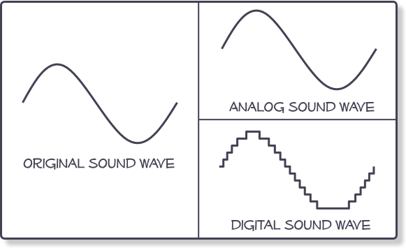
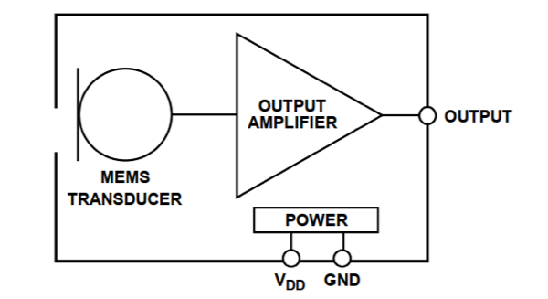
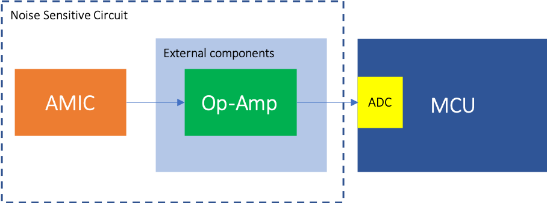
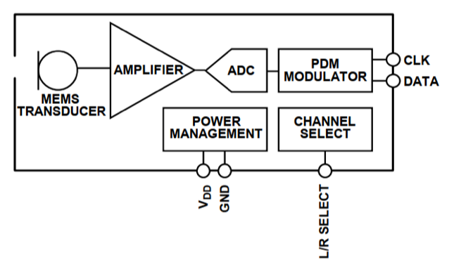
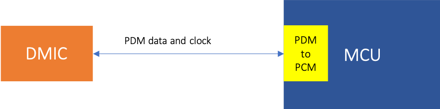

#Signal Chain Introduction of VOS development kit
Audio signal recordings come in two basic types; analog and digital. Analog refers to audio recorded using methods that replicate the original sound waves. Vinyl records and cassette tapes are examples of analog mediums. Digital audio is recorded by taking samples of the original sound wave at a specified rate. CDs and Mp3 files are examples of digital mediums.

As you can see from the diagram, the analog sound wave replicates the original sound wave, whereas the digital sound wave only replicates the sampled sections of the original sound wave.
In this document, we mainly talk **digital audio signal processing**.

##Digital Mic and Analog Mic
In **VOS development kit**, the audio signal is sampled by microphone **Mikro Board**. Then the signal passes through **Mikrobus Development Shield** to apollo3blue (or apollo2blue) EVB. Although, finally we get digital audio signal (PCM data) in apolloxBlue EVB, we do have 2 types of signal chain. One is **digital MIC** + **PDM** to **PCM Data**. Another is **Analog MIC** + **ADC Module** to **PCM Data**.
###Analog Mic

Analog MEMS microphones allow a straightforward interface to the host system. However, it should be noted that due a large dynamic range of analog signal representing the acoustic input sensed, extra signal conditioning circuit usually is required in the system.
**Disadvatage**

* More components required externally.
* More sensitive to noise, external circuit and components has to be carefully designed. E.g. resistors are a source of noise and that a resistor, R kΩ, generates a white noise source of 4√(R) nV/√Hz
* AMIC placement in the system has to be considered since longer trace introduces higher vulnerability to noise interference.
* Introduces power consumption of the signal conditioning circuit (Op Amp + external circuit) and the ADC module.

**Advantage**

* Lower cost than digital microphone
* Lower latency
* Lower power consumption (there is no internal ADC)

###Digital Mic

Digital microphones move the analog-to-digital conversion function from the codec into the microphone, enabling an all-digital audio capture path from the microphone to the processor. Digital MEMS microphones are often used in applications where analog audio signals may be susceptible to interference. 

**Advantage**

* Immunity to RF noise and electromagnetic interference (EMI)
* Analog signal conditioning not required.
* Robust digital transmission
* Simple hardware interface with minimum external components.
* PDM mics can be put to static mode: PDM clock stops (very low power consumption on DMICs and no power consumption on PDM-to-PCM module)

**Disadvantage**

* more expensive than analog microphone
* larger latency
* higher power consumption at component level

*We use digital micophone to get the audio signal in Key-Word-Detection project because of the PDM module integrated in apollo platform. It could simplize both hardware and software design. Analog microphone is only used for Wake-On-Sound function in certain user cases.*
