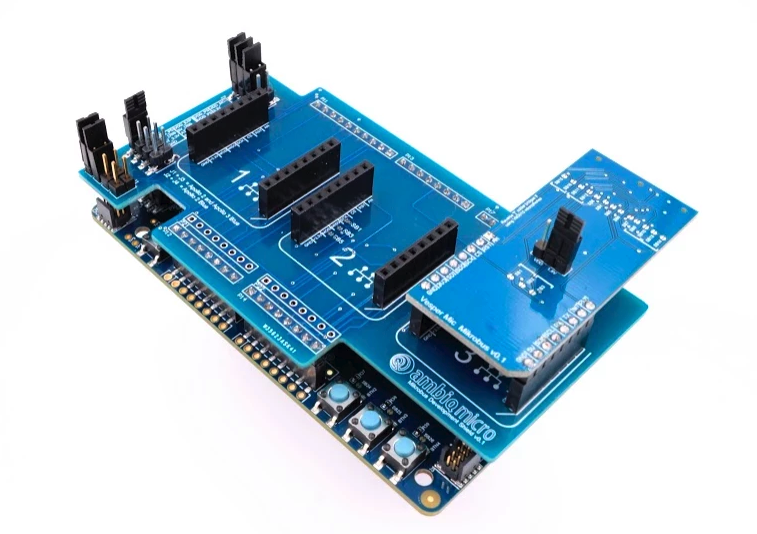
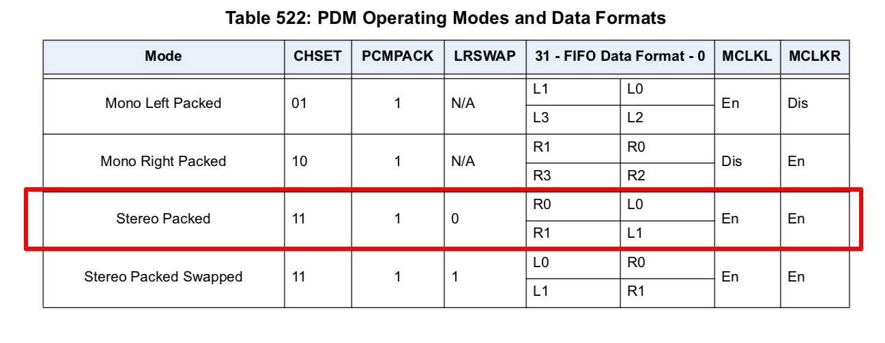

#Getting the real-time audio signal with VOS dev-kit


The above image shows that VOS development kit consists of 3 parts: apollo2blue or apollo3blue evb, microbus development shield and MIC mikro board (including 2 digital microphones and 1 optional analog microphones).

Making use of PDM module in apollo MCU, we could easily get the audio data of PCM format in the FIFO register. With PCM data, we could implement all kinds of audio signal processing algorithms and key word detection models. Now, let's first have a look at how to properly configure PDM module in apollo MCU and the format of PCM data we get from PDM data FIFO regester.

##PDM module configuration in apollo MCU
In VOS SDK, PDM module is configured as the following code shows:

```
    am_hal_pdm_config_t g_sPdmConfig = {
        .eClkDivider = AM_HAL_PDM_MCLKDIV_1,                            // PDM clock divider
        .eLeftGain = AM_HAL_PDM_GAIN_P105DB,                            // Left channel PCM data gain 
        .eRightGain = AM_HAL_PDM_GAIN_P105DB,                           // Right channel PCM data gain
        .ui32DecimationRate = 24,                                       // OSR = 48 and sample rate = 15.625 KHZ
        .bHighPassEnable = 0,                                           // Enable high-pass filter
        .ui32HighPassCutoff = 0x4,                                      // high-pass filter gain value
        .ePDMClkSpeed = AM_HAL_PDM_CLK_750KHZ,                          // PDM clock frequency 
        .bInvertI2SBCLK = 0,                                            
        .ePDMClkSource = AM_HAL_PDM_INTERNAL_CLK,                       // PDM clock source selection
        .bPDMSampleDelay = 0,                                           // PDM delayed samples number
        .bDataPacking = 1,                                              // make PCM data packed
        .ePCMChannels = AM_HAL_PDM_CHANNEL_STEREO,                      // using 2 channels: right and left
        .bLRSwap = 0,                                                   // not swap the left and right channel data 
    };

```
So, we could get the PCM data as following format:


##PCM data output to PC
In order to evaluate audio signal processing algorithms, we always need to output the audio data (e.g. PCM data got as the above section) to PC. We use SEGGER RTT interface to achieve high data-rate transfer.

###Why we choose SEGGER RTT?
Here we do a small calculation about how much data transfer rate we need to send all PCM data to PC from Apollo MCU. 

>There are about 16000 samples for 1 second audio signal 
>
>Each sample consists of 2 channels of data, left channel and right channel.
>
>Each channel data is of 16-bit length.
>
>So, we need transfer 4*16000 = 64 KB per second.
>

The highest baud rate of UART interface Apollo MCU support is 921600 bit-per-second, which is at most 11.5 KB per second. *So, we could only choose SEGGER RTT interface to transfer audio data.*

###Configure SEGGER RTT in apollo MCU and PC
####Configure SEGGER RTT sender in apollo MCU

* Add following c files into your project, which could be found in SEGGER website:

```
SEGGER_RTT.c
SEGGER_RTT_printf.c
```

* Call RTT init function during the initialization of your project:

```
/***************************************************************
* RTT print initialization function
* parameters:
* uint8_t* rttBuffer: The buffer where data stores and waits for being sent out
* uint32_t LenBytes: the length of RTT data buffer 
*
***************************************************************/
void am_app_KWD_rtt_init(uint8_t* rttBuffer, uint32_t LenBytes)
{
    
    SEGGER_RTT_ConfigUpBuffer(1, "DataLogger", rttBuffer, LenBytes, SEGGER_RTT_MODE_BLOCK_IF_FIFO_FULL);

}
```

* Call RTT record function to print data you want:

```
/***************************************************************
* RTT print function
* parameters:
* uint8_t* pBuffer: The buffer where the target data stores
* uint32_t NumBytes: the length of data stream needs to be tranfer 
*
***************************************************************/
void am_app_KWD_rtt_record(void* pBuffer, uint32_t NumBytes)
{
    uint32_t bytes_stored;
    bytes_stored = SEGGER_RTT_Write(1, (uint8_t*)pBuffer, NumBytes);
}
```
 
**Both 2 above functions could be found in `am_app_KWD_rtt_recorder.c` file.*

####Configure SEGGER RTT receiver in PC

You could run J-Link RTT Logger in your PC with following configuraion:

```
Device name. Default: AMA3B1KK-KBR
Target interface. > SWD
Interface speed [kHz]. Default: 4000 kHz
RTT Control Block address. Default: auto-detection
RTT Channel name or index. Default: channel 1
``` 
(You also need to name the rtt-log to save the data and it will be saved as binary format.)

If you're in Windows environment, you could also easily run the .bat script `kwd_audio_datalogger.bat`. 

*Before runing the script, you need to first add the path of J-Link RTT Logger to the environment variable list to your system.*


   